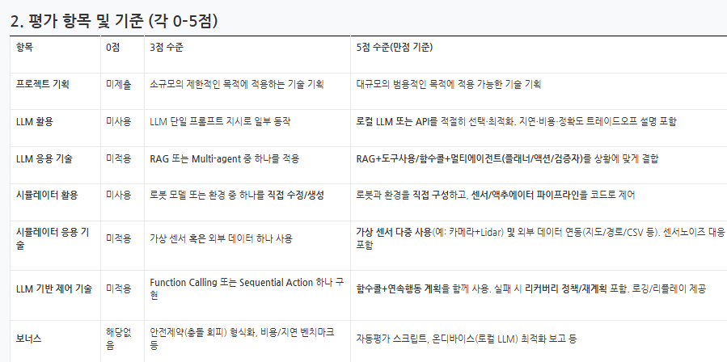

## Scoring Criteria
| Category                             | 0 Points (Not Applied) | 3 Points (Intermediate Level)                                                                  | 5 Points (Full Marks / Advanced Level)                                                                                                |
| ------------------------------------ | ---------------------- | ---------------------------------------------------------------------------------------------- | ------------------------------------------------------------------------------------------------------------------------------------- |
| **Project Planning**                 | Not submitted          | Applies technology appropriate for a small-scale, limited project goal                         | Applies technology scalable to large-scale and general-purpose objectives                                                             |
| **Utilization of LLMs**              | Not applied            | Uses a single LLM prompt or a simple instruction                                               | Selects and optimizes a local or API-based LLM. Includes fine-tuning or training explanations with validation accuracy                |
| **LLM Application Techniques**       | Not applied            | Applies one of RAG or Multi-Agent techniques                                                   | Combines RAG + tool usage / function calling / multi-agent (planner, action, verification agents) according to the situation          |
| **Utilization of Simulator**         | Not applied            | Builds or generates a simple simulation environment and robot model                            | Controls the robot’s behavior and sensing pipeline (sensor/action interface) directly through code                                    |
| **Simulator Application Techniques** | Not applied            | Uses one type of virtual sensor or external data                                               | Uses multiple virtual sensors (e.g., camera + LiDAR) and integrates external data (maps/CSV logs). Includes sensor-to-LLM interfacing |
| **LLM-Based Control Techniques**     | Not applied            | Implements a single Function Call or Sequential Action                                         | Implements hierarchical or reactive control combining multiple actions. Includes retry/recovery policies and loop/relay control       |
| **Bonus**                            | Not applied            | Includes safety constraint (collision avoidance) implementation, cost/latency benchmarks, etc. | Includes automated evaluation scripts, on-device (local LLM) optimization report, etc.                                                |

## Project report aligned to scoring criteria

### 1) 프로젝트 기획 (Project planning)

- 목표: 멀티에이전트 LLM과 Isaac Sim을 결합하여 GR‑1 로봇이 테이블탑 매니퓰레이션 테스크(Nut Pouring, Exhaust Pipe Sorting, Bowl-on-Scale)을 수행하도록 함.
- 범위: 단일 로봇(GR‑1), RGB 카메라 기반 관찰, 두 가지 행동 소스(로컬 GR00T 정책 추론 + 녹화 기반 Action Library). LLM은 계획/선택/검증을 담당.
- 산출물: 실행 스크립트, 결과 mp4, 액션 녹화/재생 파이프라인, GR00T 미세학습 러너.
- 근거: `run_multiagent_sim.py`, `multiagent_system.py`, `run_inference_server.py`, `run_simulation_with_recorder.py`, `run_action_replay.py`, `run_finetune.py`, `action_library/`.

### 2) LLM 활용 (Use of LLMs)

- 비전 LLM: `multiagent_system.py`에서 기본값 `gpt-5-mini`를 Planner/Supervisor로 사용(환경 이미지 기반 계획·검증).
- 로컬 정책: `run_inference_server.py`에서 GR00T를 로컬 GPU로 로드하고 FastAPI `/inference` 제공(저지연·저비용 동작 생성).
- 트레이드오프: 계획/검증(클라우드) + 제어(로컬)로 역할 분담.

### 3) LLM 응용 기술 (Application techniques)

- CrewAI 멀티에이전트: Planner → Implementer → Supervisor 체계. `@tool` 기반으로 액션 라이브러리/상태 조회 도구 제공.
- 시뮬레이터 함수 호출: `SimulatorBridge.callback()`가 "run_groot"/"execute_action" 명령을 처리.
- 실패/재시도: `MAX_RETRIES`와 Supervisor 피드백으로 재계획 수행.
- 최적화된 비전 검증: 2단계 접근법으로 성능 향상
  - Stage 1: OpenAI Vision API가 이미지를 직접 분석하여 텍스트 설명 생성
  - Stage 2: Supervisor 에이전트가 텍스트 기반으로 빠른 의사결정 수행
  - `ActionLibraryTool.analyze_images_with_openai()` 메서드 활용
  - 검증 속도: 40-60초 → 5-15초로 개선

### 4) 시뮬레이터 활용 (Use of simulator)

- USD 스테이지 로드, 로봇 스폰, 카메라 생성, 조인트 제어, mp4 기록을 코드로 구성.
- 근거: `run_simulation.py`, `run_multiagent_sim.py`, `run_action_replay.py`, `sim_environments/*.usd`.

### 5) 시뮬레이터 응용 기술 (Advanced sim application)

- 다중 태스크·자산 지원, 액션 녹화/재생에 의한 재현성, GR00T 미세학습 파이프라인 제공.
- 현재 센서는 RGB 카메라 중심 (현재 Tabletop 학습 추세는 카메라만 활용).

### 6) LLM‑based control (LLM 기반 제어 기술)

- 함수 호출 패턴으로 도구/시뮬레이터 연계, 연속 행동 계획 실행, 실패 시 재시도.
- 행동 소스 복합: 로컬 GR00T(16‑스텝 궤적) + 녹화 액션 재생. mp4 기록과 리플레이 지원.
- 효율적인 비전 기반 검증 파이프라인:
  - 이미지 인코딩: `encode_image_to_base64()` (cv2 기반)
  - 비전 분석: OpenAI Vision API 직접 호출 (단일 API 요청)
  - 의사 결정: 텍스트 기반 LLM 추론 (CrewAI 에이전트)
  - 검증 이미지 저장: `./results/verification_images/` (수동 검토 가능)

### 7) 보너스 (Bonus)

- 자동 평가 스크립트와 온디바이스 비전 LLM 최적화 보고는 향후 과제.
- Supervisor evaluation 기능에 리포트 보고 기능 추가만 하면 됨.

---

## Evidence map (files → 기능)

- 시뮬레이션/센서/액추에이터: `run_simulation.py`, `run_multiagent_sim.py`, `sim_environments/*.usd`
- 멀티에이전트/도구: `multiagent_system.py`, `multiagent_tools.py`
  - 최적화된 비전 검증: `multiagent_tools.py::ActionLibraryTool.analyze_images_with_openai()`
  - 2단계 검증 로직: `multiagent_system.py::MultiAgentRobotSystem._supervisor_verify()`
- 정책/학습: `run_inference_server.py`, `gr1_gr00t_utils.py`, `run_finetune.py`
- 녹화/재생/라이브러리: `run_simulation_with_recorder.py`, `run_action_replay.py`, `action_library/*.json`

